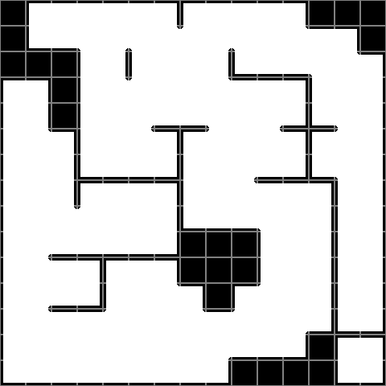

# ASCII Marching Squares

## Description

Marching Squares is the 2D variant of the Marching Cubes algorithm.
This tool is a marching squares for binary values, specified in an ascii file.

The output is a tiling of a primitive set.
The primitive set contains sixteen cases, as defined by the SW (bit0), SE (bit1), NW (bit2) and NE (bit3) quadrants.

A sample primitive set that can be used:


When combined with the input...
```
XXXXXXXXXXXXXXXX
XX-----X----XXXX
XXXX-X---X----XX
XXXX-X---XXXX--X
X-XX--------X--X
X-XX--XXX--XXX-X
X--X---X----X--X
X--XXXXX--XXXX-X
X--X---X-----X-X
X------XXXX--X-X
X-XXXXXXXXX--X-X
X---X--XXXX--X-X
X-XXX---XX---X-X
X-----------XXXX
X--------XXXXX-X
XXXXXXXXXXXXXXXX
```

...the following output image will be assembled:


## Requirements

You require python3 installation in /usr/bin/python3

You need to have Imagemagick 'convert' and 'display' tools installed, and accessible in path.

## Usage

```
./ams map0.txt
```

